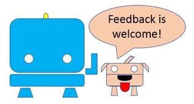

# TJBot and her/his dog

TJBot is a brilliant way to introduce and play with IBM Watson solution and robotics.

Node-Red makes programming a very easy task, from children to grandparents.

Doggy demonstrates how to expand TJBot using common and low cost IOT devices.

**Mixing all together is an excellent way to have fun and effective activities.**

_Ferruccio Manclossi, IBM Italy, September 2018_

Doggy is an original idea from a team of IBM Italy Volunteers. The first draft was developed during a stage with high school students in IBM Segrate, July 2018. A special **GRAZIE** to Fabrizio Repossi, Hossam Lemtaffah, Matteo Vergottini, Riccardo Manfredonia, Thierno Filippo D'Amelio and Usama Muhammad

**Download Activity Kit [PDF format](https://github.com/fmanclossi/TJBot-playbook/blob/master/examples/Doggy/Activity%20Kit%20Doggy%2020181001.pdf), [PowerPoint format](https://github.com/fmanclossi/TJBot-playbook/blob/master/examples/Doggy/Activity%20kit%20Doggy%2020181001.pptx) or follow on-line instructions (up-to-date)**

It works with TJBot already configured as described in [setup pages](https://github.com/fmanclossi/TJBot-playbook/tree/master/setup).

## Doggy's family

* DOGGY BASIC - Doggy hosts an HC-SR04 sensor that provides a superdog vision.

* DOGGY STANDARD - In addition to BASIC format, Doggy  has also a very cute tail, powered by one SG-90 servo motor.

* DOGGY ADVANCED (PREMIUM) - Doggy increases its capability with two motorized front legs.

* MINIDOGGY - This little Doggy has just tail, powered by one SG-90 servo motor. No superdog vision!

Doggy is very easy to build because it provided with A4 format. Just print/copy it and cut, fold, connect!

**Level: some task could be tricky but could be performed under adult’s guidance**

## [Funny labs using Doggy](Tales%20of%20two%20doggies.md)

TJBot loves pets even though they can be noisy. He/Her owns two dogs, Doggy and MiniDoggy.

Doggy is a very careful watchdog while MiniDoggy is more distracted one, it doesn’t look at what happens around it but it’s happy to play with TJBot.

We follow TJBot and its doggies in some [funny stories](https://github.com/fmanclossi/TJBot-playbook/blob/master/examples/Doggy/Tales%20of%20two%20doggies.md) learning how IBM solutions could be applied to real life examples.

## Print and Build your preferred Doggy

[How to build Doggy](https://github.com/fmanclossi/TJBot-playbook/blob/master/examples/Doggy/Print%20and%20Build%20Doggy.md)

## Configure Doggy's
 [Video tutorial - How to setup and test Doggy's features](https://www.youtube.com/playlist?list=PLXiMV-sceqdVLYL1ZvgVZcMXMVVyajM2z)

[How to setup and test Doggy's features (old but still good tutorial)](https://github.com/fmanclossi/TJBot-playbook/blob/master/examples/Doggy/Setup%20Doggy%20and%20Test%20features.md)

# HAVE FUN and REPORT ISSUES!!! PHOTOS, VIDEOS, FEEDBACKS are WELCOME!

# License  
This project uses the [Apache License Version 2.0](../../LICENSE) software license.  
