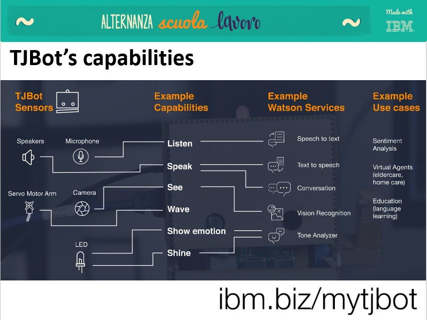
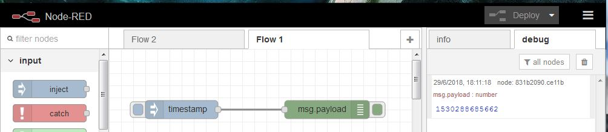
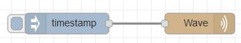
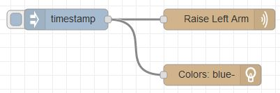

# Segrate Alternanza Scuola Lavoro May 2018

This page collects TJBot activities performed with high-school students at IBM Segrate HQ in May, 2018.

Work with four TJBot already configured as described in [setup pages](https://github.com/fmanclossi/TJBot-playbook/tree/master/setup).

## Setup requirements:

* Copy [actions](Images/actions) folder to [TJbot http public path.](https://github.com/fmanclossi/TJBot-playbook/blob/master/setup/Setup_Node-Red_on_TJBot.md#setup-node-red-on-tjbot)

* Copy [HTML_files](HTML_files) on students laptop.

* add a sticker to each TJBot with its own IP ADDRESS.

Students work in team up to 4 members with a dedicated TJBot. Smaller groups are better, of course.

## Step 1 - Introduce TJBot

**Do you like TJBot?** So, there will be no problem to explain our preferred robot :)

Use a single chart from main presentation:

In addition, you can use an enhanced TJBot to show how much is easy to expand it.

## Step 2 - Introduce Node-Red

### Node-Red Flow Editor

Guide students to connect to Node-Red flow editor pointing available browser to http:<<TJBot_ip_address>>:1880

### Explain Node-Red

Node-RED is a flow-based development tool developed by Nick O’Leary and Dave Conway-Jones of IBM’s Emerging Technology Services group for wiring together hardware devices, APIs and online services as part of the Internet of Things. Node-RED coding is performed by a browser-based flow editor.

Then show that Node-Red is just connect nodes with tubes. Nodes can be used to input info in tubes, extract info from them or elaborate data that pass through the pipe.

### Guide the student to create a simple wire using INJECT and DEBUG nodes.

## Step 3 - Introduce TJBot Node-Red nodes

### Guide students to TJBot nodes

Ask to insert TJ in "filter nodes" search box (left high corner of Node-Red Flow Editor) to quickly find TJBot nodes and introduce them (you can also use a slide).

### Let's create a simple TJBot flow

Suggest to use INJECT and WAVE nodes to program the most simple TJBot example.

Challenge team to create a flow that raise arm and turn BLUE the LED. (so, you can explain TJBot LED and SHINE node).

Ask to Turn LED on RED, then wave arm and finally turn off the LED.

Open Question: Why I can see RED light?

Introduce SLEEP node and ask to modify the flow in order to have RED light available for 2 seconds.

*.... to be completed...*

(if you have time, let the students free to create their own TJBot movement.

### Create a web site powered by TJBot

*.... to be completed...*

[Node-Red Labs with TJBot!](https://github.com/fmanclossi/TJBot-playbook/tree/master/examples/Segrate_ASL2018)

....

# License  
This project uses the [Apache License Version 2.0](../../LICENSE) software license.  
